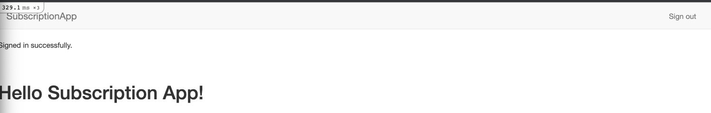

<!-- START doctoc generated TOC please keep comment here to allow auto update -->
<!-- DON'T EDIT THIS SECTION, INSTEAD RE-RUN doctoc TO UPDATE -->
**Table of Contents**  *generated with [DocToc](https://github.com/thlorenz/doctoc)*

- [Integrating Payments with Rails](#integrating-payments-with-rails)
  - [Test users](#test-users)
  - [Getting Started](#getting-started)
    - [App Overview](#app-overview)
    - [Initializing Sample App](#initializing-sample-app)
  - [Creating Users](#creating-users)
    - [Devise](#devise)
    - [Creating the Navigation Bar](#creating-the-navigation-bar)
  - [Creating Publications](#creating-publications)
  - [Publication Model](#publication-model)
    - [Admin and Subscriber Modelling](#admin-and-subscriber-modelling)
  - [Introduce the Stripe API](#introduce-the-stripe-api)
    - [Integrating Stripe and Dotenv](#integrating-stripe-and-dotenv)
  - [Adding Subscriptions](#adding-subscriptions)
    - [Creating the Subscription Model](#creating-the-subscription-model)
    - [Creating the User Info Screen](#creating-the-user-info-screen)
    - [Adding Stripe.js](#adding-stripejs)
      - [Troubleshooting Webpacker](#troubleshooting-webpacker)
      - [Stripe and Subscriptions](#stripe-and-subscriptions)

<!-- END doctoc generated TOC please keep comment here to allow auto update -->

# Integrating Payments with Rails

> My notes from Pluralsight [course](https://app.pluralsight.com/library/courses/ruby-on-rails-integrating-payments/table-of-contents)

Versions:

```bash
rbenv local
# 2.7.2

rails --version
# Rails 6.1.6
```

(instructor using rails 4.1.2)

## Test users

* test1@test.com/123456
* test2@test.com/123456
* subscription_admin@test.com/password

## Getting Started

### App Overview

Will build subscription app where users can sign in (using devise), and purchase a subscription to get access to a weekly podcast on tech. Will be integrating Stripe for payments.

### Initializing Sample App

```bash
rails new subscription-app
cd subscription-app
bin/rails db:create
# Created database 'db/development.sqlite3'
# Created database 'db/test.sqlite3'
bin/rails s
```

Verify Rails landing page at `http://localhost:3000/`

## Creating Users

### Devise

Will use this gem: https://github.com/heartcombo/devise

Devise automatically adds routes for user management including:
* new_user_session GET /users/sign_in
* destroy_user_session DELETE /users/sign_out
* new_user_registration GET /users/sign_up

Provides helper methods including:
* `authenticate_user!` - run before any controller action to ensure a valid user is signed in
* `user_signed_in?` - check if a current user is logged in
* `current_user` - reference to user model object that is currently logged in
* `user_session` - reference to session object that Devise creates to contain the signed in user

**User Model**

Users will have `email` and `password` fields, used to authenticate to the app, with support from devise. Devise will create the user table with default columns that make sense for most web apps.

We'll also need to design a simple UI to let users sign up, sign in, sign out, and display their current info.

**Installing Devise**

Follow instructions on project homepage: https://github.com/heartcombo/devise#getting-started
* add to Gemfile, bundle install
* rails generate devise:install

Creates some files:
```
create  config/initializers/devise.rb
create  config/locales/devise.en.yml
```

And some further instructions:
```
Depending on your application's configuration some manual setup may be required:

1. Ensure you have defined default url options in your environments files. Here
   is an example of default_url_options appropriate for a development environment
   in config/environments/development.rb:

     config.action_mailer.default_url_options = { host: 'localhost', port: 3000 }

   In production, :host should be set to the actual host of your application.

   * Required for all applications. *

2. Ensure you have defined root_url to *something* in your config/routes.rb.
   For example:

     root to: "home#index"

   * Not required for API-only Applications *

3. Ensure you have flash messages in app/views/layouts/application.html.erb.
   For example:

     <p class="notice"><%= notice %></p>
     <p class="alert"><%= alert %></p>

   * Not required for API-only Applications *

4. You can copy Devise views (for customization) to your app by running:

     rails g devise:views

   * Not required *
```

Add the config as per step 1 of instructions.

Devise automatically redirects user to root url after successful registration or login, therefore, need to define `root` in `config/routes.rb`. So we need to define a page in our app for this.

Start by adding it to router:

```ruby
# subscription-app/config/routes.rb
Rails.application.routes.draw do
  root to: "home#index"
end
```

Add a home controller with an empty index method:

```ruby
# subscription-app/app/controllers/home_controller.rb
class HomeController < ApplicationController
  def index
  end
end
```

Add corresponding view:

```erb
<!-- subscription-app/app/views/home/index.html.erb -->
<h1>Hello Subscription App!</h1>
```

To test our work so far, start rails server with `bin/rails s`, then navigate to `http://localhost:3000`, should see Hello in h1 tag. This confirms that home/index is the root page for the app.

Now go back and complete instruction 3 from Devise to add flash messages to application layout. Add the messages inside the body tag, before the yield. Devise will use this to display notices and error messages on any page where they occur. Eg: after user successfully signs in, `notice` message will say "You have successfully signed in". If signin fails, an error message shows up in `alert` section.

```erb
<!-- subscription-app/app/views/layouts/application.html.erb -->
<!DOCTYPE html>
<html>
  <head>
    <title>SubscriptionApp</title>
    <meta name="viewport" content="width=device-width,initial-scale=1">
    <%= csrf_meta_tags %>
    <%= csp_meta_tag %>

    <%= stylesheet_link_tag 'application', media: 'all', 'data-turbolinks-track': 'reload' %>
    <%= javascript_pack_tag 'application', 'data-turbolinks-track': 'reload' %>
  </head>

  <body>
    <p class="notice"><%= notice %></p>
    <p class="alert"><%= alert %></p>
    <%= yield %>
  </body>
</html>
```

Ignore devise instruction 4 as we're not deploying to Heroku or using older Rails version.

We'll also skip instruction 5 as its just a learning app and no need to customize the views provided by Devise.

Shutdown Rails server if running, and perform next instruction from Devise github page. Our model will be `User`. This creates a db migration, model, and routes:

```
bin/rails generate devise User
```

Output:

```
invoke  active_record
create    db/migrate/20220801115656_devise_create_users.rb
create    app/models/user.rb
invoke    test_unit
create      test/models/user_test.rb
create      test/fixtures/users.yml
insert    app/models/user.rb
 route  devise_for :users
```

Run migration with `bin/rails db:migrate`, output:

```
== 20220801115656 DeviseCreateUsers: migrating ================================
-- create_table(:users)
   -> 0.0025s
-- add_index(:users, :email, {:unique=>true})
   -> 0.0010s
-- add_index(:users, :reset_password_token, {:unique=>true})
   -> 0.0008s
== 20220801115656 DeviseCreateUsers: migrated (0.0044s) =======================
```

To see what Devise has done, start server `bin/rails s`.

`http://localhost:3000` should still show Hello message.

`http://localhost:3000/users/sign_in` displays a login form (view was generated by Devise, we didn't have to write any code for this):


Click on "Sign up" link navigates to registration form, again, we didn't write any code for this `http://localhost:3000/users/sign_up`:


Try it out by creating a new user: `test1@test.com`/`123456`. Redirects to home page with flash `notice` at top of page displaying success message:


But if restart Rails server then refresh page, flash message goes away, so how do we know if user is signed in? Session cookie is there, but later will add navigation bar to allow user to sign in/out.

### Creating the Navigation Bar

Instructor using [Bootstrap 3](https://getbootstrap.com/docs/3.3/).

Will implement as partial so the nav bar can be re-used in multiple views.

Update application layout to link Bootstrap 3 from a CDN, and render the nav partial:

```erb
<!-- subscription-app/app/views/layouts/application.html.erb -->
 <!DOCTYPE html>
 <html>
   <head>
     <title>SubscriptionApp</title>
     <meta name="viewport" content="width=device-width,initial-scale=1">
     <%= csrf_meta_tags %>
     <%= csp_meta_tag %>

     <%= stylesheet_link_tag 'application', media: 'all', 'data-turbolinks-track': 'reload' %>
     <%= javascript_pack_tag 'application', 'data-turbolinks-track': 'reload' %>
     <link rel="stylesheet" href="https://maxcdn.bootstrapcdn.com/bootstrap/3.3.5/css/bootstrap.min.css">
   </head>

   <body>
     <%= render "nav" %>
     <p class="notice"><%= notice %></p>
     <p class="alert"><%= alert %></p>
     <%= yield %>
   </body>
 </html>
```

Trying to navigate to `http://localhost:3000/` will get an error because we haven't yet created the nav partial. Error message shows where Rails is looking:

```
Missing partial home/_nav, application/_nav with {:locale=>[:en], :formats=>[:html], :variants=>[], :handlers=>[:raw, :erb, :html, :builder, :ruby, :jbuilder]}. Searched in:
* "/Users/dbaron/projects/pluralsight/payments-rails-pluralsight/subscription-app/app/views"
* "/Users/dbaron/.rbenv/versions/2.7.2/lib/ruby/gems/2.7.0/gems/devise-4.7.3/app/views"
* "/Users/dbaron/.rbenv/versions/2.7.2/lib/ruby/gems/2.7.0/gems/actiontext-6.1.6.1/app/views"
* "/Users/dbaron/.rbenv/versions/2.7.2/lib/ruby/gems/2.7.0/gems/actionmailbox-6.1.6.1/app/views"
```

Note that partial file names always start with `_`.

The nav will be needed on every page in this app so let's define it in `app/views/application/_nav.html.erb` (need to create new `application` folder in `views` dir). Then paste in the [Bootstrap 3 nav example](https://getbootstrap.com/docs/3.3/components/#nav), remove unused parts and update for our subscription app.

Also using `user_signed_in?` Devise helper to determine if should render a Sign out link in nav, or Sign in and Sign up links (not implemented yet). Also using `link_to` and `destroy_user_session` helper to generate sign out link.

Note that `destroy_user_session` looks like this in output of `bin/rails routes`:

```
 Prefix Verb   URI Pattern                                                                                       Controller#Action
destroy_user_session DELETE /users/sign_out(.:format)                                                                         devise/sessions#destroy
```

```erb
<!-- subscription-app/app/views/application/_nav.html.erb -->
<nav class="navbar navbar-default">
  <div class="container-fluid">
    <!-- Brand and toggle get grouped for better mobile display -->
    <div class="navbar-header">
      <a class="navbar-brand" href="/">SubscriptionApp</a>
    </div>

    <!-- Collect the nav links, forms, and other content for toggling -->
    <div class="collapse navbar-collapse" id="bs-example-navbar-collapse-1">
      <ul class="nav navbar-nav navbar-right">
        <% if user_signed_in? %>
          <li>
            <%= link_to "Sign out", destroy_user_session_path, method: :delete %>
          </li>
        <% else %>
          <li><a href="#">Sign in</a></li>
          <li><a href="#">Sign up</a></li>
        <% end %>
      </ul>
    </div><!-- /.navbar-collapse -->
  </div><!-- /.container-fluid -->
</nav>
```

Now navigating to `http://localhost:3000/` looks like this:


DOM generated from signout link:

```htm
<a rel="nofollow" data-method="delete" href="/users/sign_out">Sign out</a>
```

Clicking Sign out link signs user out and then view re-renders with Sign in and Sign up links. Rails server output shows:

```
Started DELETE "/users/sign_out" for ::1 at 2022-08-27 08:37:33 -0400
Processing by Devise::SessionsController#destroy as HTML
  Parameters: {"authenticity_token"=>"[FILTERED]"}
  User Load (0.1ms)  SELECT "users".* FROM "users" WHERE "users"."id" = ? ORDER BY "users"."id" ASC LIMIT ?  [["id", 1], ["LIMIT", 1]]
Redirected to http://localhost:3000/
Completed 302 Found in 36ms (ActiveRecord: 0.1ms | Allocations: 4253)


Started GET "/" for ::1 at 2022-08-27 08:37:33 -0400
Processing by HomeController#index as HTML
  Rendering layout layouts/application.html.erb
  Rendering home/index.html.erb within layouts/application
  Rendered home/index.html.erb within layouts/application (Duration: 0.2ms | Allocations: 38)
[Webpacker] Everything's up-to-date. Nothing to do
  Rendered application/_nav.html.erb (Duration: 2.0ms | Allocations: 120)
  Rendered layout layouts/application.html.erb (Duration: 10.9ms | Allocations: 3778)
Completed 200 OK in 13ms (Views: 11.7ms | ActiveRecord: 0.0ms | Allocations: 4162)
```


Update nav partial to use devise paths for sign in and sign up:

```erb
<nav class="navbar navbar-default">
  <div class="container-fluid">
    <!-- Brand and toggle get grouped for better mobile display -->
    <div class="navbar-header">
      <a class="navbar-brand" href="/">SubscriptionApp</a>
    </div>

    <!-- Collect the nav links, forms, and other content for toggling -->
    <div class="collapse navbar-collapse" id="bs-example-navbar-collapse-1">
      <ul class="nav navbar-nav navbar-right">
        <% if user_signed_in? %>
          <li>
            <%= link_to "Sign out", destroy_user_session_path, method: :delete %>
          </li>
        <% else %>
          <li>
            <%= link_to "Sign in", new_user_session_path %>
          </li>
          <li>
            <%= link_to "Sign up", new_user_registration_path %>
          </li>
        <% end %>
      </ul>
    </div><!-- /.navbar-collapse -->
  </div><!-- /.container-fluid -->
</nav>
```

Links render in dom as:

```htm
<a href="/users/sign_in">Sign in</a>
<a href="/users/sign_up">Sign up</a>
```

Clicking Sign in navigates to `http://localhost:3000/users/sign_in`:


Clicking Sign up navigates to `http://localhost:3000/users/sign_up`:


Try to sign in with account made earlier in course `test1@test.com"/123456`. It should navigate to home view `http://localhost:3000` with sign in successful message:



Enhance nav partial to display the currently signed in user's email address. Use devise helper `current_user` which returns the user model of the user that is currently in the session. Wrap it in an anchor tag for bootstrap nav styling. In a real app, this would link to a user profile/settings page:

```erb
<nav class="navbar navbar-default">
  <div class="container-fluid">
    <!-- Brand and toggle get grouped for better mobile display -->
    <div class="navbar-header">
      <a class="navbar-brand" href="/">SubscriptionApp</a>
    </div>

    <!-- Collect the nav links, forms, and other content for toggling -->
    <div class="collapse navbar-collapse" id="bs-example-navbar-collapse-1">
      <ul class="nav navbar-nav navbar-right">
        <% if user_signed_in? %>
          <li>
            <a href="#">Signed in as <%= current_user.email %></a>
          </li>
          <li>
            <%= link_to "Sign out", destroy_user_session_path, method: :delete %>
          </li>
        <% else %>
          <li>
            <%= link_to "Sign in", new_user_session_path %>
          </li>
          <li>
            <%= link_to "Sign up", new_user_registration_path %>
          </li>
        <% end %>
      </ul>
    </div><!-- /.navbar-collapse -->
  </div><!-- /.container-fluid -->
</nav>
```

Refresh home view while signed in, now nav displays email address:


## Creating Publications

**Publication**
- Digital file that paying subscribers can access.
- Will be lightweight for this course as the details are not relevant for payments, which is the focus. Just have title, file_url and description.

**Administrators**
- Users with ability to CRUD publications.
- Have `is_admin` set to true (boolean field).
- We will seed an admin initially, then can create more via console.
- Ruby gems for handling admin roles include: `cancan`, `pundit`, `rolify`. But for this app, will use more basic implementation.

**Administrator and Subscriber Views**
- Admins can create, edit, update publications
- Subscribers can only view publications
- Non-subscribers can see publications, but not access the details

**Adminstrator Publication Routes**


**Subscriber Publication Routes**


**Non-Subscriber Publication Routes**


## Publication Model

Use Rails model generator, passing in desired attributes, then migrate the database:

```
bin/rails g model publication title:string description:text file_url:string
bin/rails db:migrate
```

Add publication routes using `resources` method, with `only` argument to limit what routes are generated to the read ones:

```ruby
# subscription-app/config/routes.rb
Rails.application.routes.draw do
  devise_for :users
  root to: "home#index"
  resources :publications, only: [:index, :show]
end
```

Create the view files and controller

```bash
mkdir app/views/publications
touch app/views/publications/index.html.erb
touch app/views/publications/show.html.erb
touch app/controllers/publications_controller.rb
```

Implement controller logic:

```ruby
# subscription-app/app/controllers/publications_controller.rb
class PublicationsController < ApplicationController
  def index
    @publicatiosn = Publication.all
  end

  def show
    @publication = Publication.find(params[:id])
  end
end
```

Implement index view - uses `panel` bootstrap component to render list of all publications, displaying each publication's title, description, file_url, and a link to the detail view (aka show). Note that `publication_path` requires the `publication` as an argument in order to generate a url like `/publications/:id`

```erb
<!-- subscription-app/app/views/publications/index.html.erb -->
<h2>Publications</h2>

<% @publications.each do |publication| %>
  <div class="panel panel-default">
    <div class="panel-heading">
      <h3 class="panel-title"><%= publication.title %></h3>
    </div>
    <div class="panel-body">
      <p><%= publication.title %></p>
      <p><%= publication.file_url %></p>
    </div>
    <div class="panel-footer">
      <%= link_to "View more details", publication_path(publication), class: "btn btn-default" %>
    </div>
  </div>
<% end %>
```

Create a publication in Rails console so we'll have something to see in the UI:

```ruby
p = Publication.new(title: "My first publication", description: "This is my first publication", file_url:
"http://myfilelocation.com")
p.save
```

Start server and navigate to `http://localhost:3000/publications`:


Fill in template for publication show view (i.e. showing the details of the selected publication):

```erb
<!-- subscription-app/app/views/publications/show.html.erb -->
<h2>Publication Details</h2>

<div class="panel panel-default">
  <div class="panel-heading">
    <h3 class="panel-title"><%= @publication.title %></h3>
  </div>
  <div class="panel-body">
    <p><%= @publication.title %></p>
    <p><%= @publication.file_url %></p>
  </div>
</div>
```

Now you can click on the Show Detail button from index view, which navigates to `http://localhost:3000/publications/1`:


### Admin and Subscriber Modelling

Want to support feature that some users could be administrators:

```
rails g migration add_is_admin_to_users is_admin:boolean
```

Generates:

```ruby
# subscription-app/db/migrate/20220903112034_add_is_admin_to_users.rb
class AddIsAdminToUsers < ActiveRecord::Migration[6.1]
  def change
    add_column :users, :is_admin, :boolean
  end
end
```

For a boolean column, want to ensure it can never be null. Only expect to find true or false in this column. Use `null` and `default` options to ensure this column can never be null and defaults to false:

```ruby
# subscription-app/db/migrate/20220903112034_add_is_admin_to_users.rb
class AddIsAdminToUsers < ActiveRecord::Migration[6.1]
  def change
    add_column :users, :is_admin, :boolean, null: false, default: false
  end
end
```

Run migration: `bin/rails db:migrate`. Then launch console: `bin/rails c`, and check `is_admin` property on user we created earlier. Notice that it's been set to false:

```ruby
User.last
=> #<User id: 1, email: "test1@test.com", created_at: "2022-08-01 12:05:19.855459000 +0000", updated_at: "2022-08-01 12:05:19.855459000 +0000", is_admin: false>
```

Let's create an admin user via seeds:

```ruby
# subscription-app/db/seeds.rb
User.create(
  email: 'subscription_admin@test.com',
  password: 'password',
  is_admin: true
)
```

Run it with `bin/rails db:seed`. Now there's one regular and one admin user in the database:

```ruby
User.all.each{ |user| puts("#{user.email}, is_admin: #{user.is_admin}") }
# test1@test.com, is_admin: false
# subscription_admin@test.com, is_admin: true
```

Add admin routes. Use `namespace` feature to create similar routing paths as publications, but under `/admin...`:

```ruby
# subscription-app/config/routes.rb
Rails.application.routes.draw do
  devise_for :users
  root to: "home#index"
  resources :publications, only: [:index, :show]
  namespace :admin do
    resources :publications
  end
end
```

Here are the admin routes this generates: `bin/rails routes | grep admin`

```
admin_publications      GET   /admin/publications(.:format)                                                                     admin/publications#index
                       POST   /admin/publications(.:format)                                                                     admin/publications#create
 new_admin_publication GET    /admin/publications/new(.:format)                                                                 admin/publications#new
edit_admin_publication GET    /admin/publications/:id/edit(.:format)                                                            admin/publications#edit
     admin_publication GET    /admin/publications/:id(.:format)                                                                 admin/publications#show
                       PATCH  /admin/publications/:id(.:format)                                                                 admin/publications#update
                       PUT    /admin/publications/:id(.:format)                                                                 admin/publications#update
                       DELETE /admin/publications/:id(.:format)                                                                 admin/publications#destroy
```

Create an admin controller with a `before_action` to ensure that the currently logged in user is an admin before letting them proceed. If they are not, or if there is no logged in user, then they'll be redirected to the home page with a flash alert.

`before_action`: Append a callback before actions. Instructor used `before_filter` but I got error about undefined method.

```ruby
# subscription-app/app/controllers/admin_controller.rb
class AdminController < ApplicationController
  before_action :check_for_admin

  def check_for_admin
    if current_user.nil? || !current_user.is_admin?
      redirect_to root_path, alert: "You must be an admin to access this path."
    end
  end
end
```

Add the admin publications controller. Note that it inherits from `AdminController` to get the `check_for_admin` filter. Also note private method `find_publication` to avoid code duplication in various methods that all need to find a publication by id.

`publication_params` is a private method using Rails Strong Params. It looks for a hash `publication` in the request params, and then ensures that it only contains the given list of attributes.

Note I had to namespace `Admin::PublicationsController` for class name, otherwise got super class mismatch error due to `PublicationsController` already existing under app/controllers and inheriting from ApplicationController.

```ruby
# subscription-app/app/controllers/admin/publications_controller.rb
class Admin::PublicationsController < AdminController
  before_action :find_publication, only: [:show, :edit, :update, :destroy]

  def index
    @publications = Publication.all
  end

  def show; end

  def new
    @publication = Publication.new
  end

  def create
    @publication = Publication.new(publication_params)

    if @publication.save
      redirect_to admin_publication_path(@publication)
    else
      render :new, alert: "Something went wrong."
    end
  end

  def edit; end

  def update
    if @publication.update(publication_params)
      redirect_to admin_publication_path(@publication)
    else
      render :edit, alert: "Something went wrong."
    end
  end

  def destroy
    @publication.destroy
    redirect_to admin_publications_path, alert: "Successfully deleted publication."
  end

  private

  def find_publication
    @publication = Publication.find(params[:id])
  end

  def publication_params
    params.require(:publication).permit(:title, :description, :file_url)
  end
end
```

Rails Guide on [render and redirect_to](https://guides.rubyonrails.org/layouts_and_rendering.html).

Run Rails server, then try to navigate to `http://localhost:3000/admin/publications`, will get redirected to root `http://localhost:3000` with message that you must be admin to access this page:


Login with `subscription_admin@test.com` which has `is_admin` set to true, then navigate to `http://localhost:3000/admin/publications`. This time get error: `Admin::PublicationsController#index is missing a template for request formats: text/html`.

Let's add the view. It will look similar to what regular users see, but an additional link/button to edit each publication. Also make sure the view button links to the admin version of this.

Note: To find the correct `XXX_path` helper method names, run `bin/rails routes | grep "admin"`.

```erb
<!-- subscription-app/app/views/admin/publications/index.html.erb -->
<h2>Admin Publications</h2>

<% @publications.each do |publication| %>
  <div class="panel panel-default">
    <div class="panel-heading">
      <h3 class="panel-title"><%= publication.title %></h3>
    </div>
    <div class="panel-body">
      <p><%= publication.title %></p>
      <p><%= publication.file_url %></p>
    </div>
    <div class="panel-footer">
      <%= link_to "View more details", admin_publication_path(publication), class: "btn btn-info" %>
      <%= link_to "Edit", edit_admin_publication_path(publication), class: "btn btn-default" %>
    </div>
  </div>
<% end %>
```

Here is what the `http://localhost:3000/admin/publications` view looks like now:


Let's build the edit template so that it will work when admin user clicks the edit button from this view. The edit view uses `form_for` Rails view helper to build the form, together with Bootstrap classes `form-group`, `form-control`, etc for styling.

```erb
<!-- subscription-app/app/views/admin/publications/edit.html.erb -->
<h3>Edit <%= @publication.title %></h3>

<%= form_for @publication, url: admin_publication_path(@publication) do |f| %>
  <div class="form-group">
    <label>Title</label>
    <%= f.text_field :title, class: 'form-control' %>
  </div>
  <div class="form-group">
    <label>Description</label>
    <%= f.text_area :description, class: 'form-control' %>
  </div>
  <div class="form-group">
    <label>File URL</label>
    <%= f.text_field :file_url, class: 'form-control' %>
  </div>
  <div class="form-group">
    <%= f.submit "Update Publication", class: 'btn btn-primary' %>
  </div>
<% end %>
```

Note that the generated form will POST to `admin_publication_path(@publication)`. This will get translated by Rails to a PATCH to `/admin/publications/:id`, which will run the `update` method in `subscription-app/app/controllers/admin/publications_controller.rb`.

Note the use of `f.text_field` for publication title and file_url, whereas `f.text_area` used for publication description. This is because title and file_url are `string` type in the database, whereas description field, which could be longer is of type `text`. See [data types in SQLite](https://www.sqlite.org/datatype3.html).

Try out the form now and make any edit and submit the form. The update is applied, and the controller attempts to redirect to the show path, eg: `http://localhost:3000/admin/publications/1` but get error `Template is missing`.

Implement show view in admin path - for now, just copy over implementation from regular publications path:

```erb
<!-- subscription-app/app/views/admin/publications/show.html.erb -->
<h2>Admin Publication Details</h2>

<div class="panel panel-default">
  <div class="panel-heading">
    <h3 class="panel-title"><%= @publication.title %></h3>
  </div>
  <div class="panel-body">
    <p><%= @publication.title %></p>
    <p><%= @publication.file_url %></p>
  </div>
</div>
```

Update admin publications index view so an admin can create a new application by adding a link (styled as a button) to the new admin path (view not created yet):

```erb
<!-- subscription-app/app/views/admin/publications/index.html.erb -->
<h2>Admin Publications</h2>

<%= link_to "New Publication", new_admin_publication_path, class: "btn btn-primary" %>

<% @publications.each do |publication| %>
  <!-- ... -->
<% end %>
```

Admin publications view `http://localhost:3000/admin/publications` now looks like this:


Where rendered html for New Publication link/button is:

```htm
<a class="btn btn-primary" href="/admin/publications/new">New Publication</a>
```

Add a view for `/admin/publications/new` so that we can actually use the new button. Paste in code from edit view because the forms for new and edit are almost the same, with a few changes:

* Change title to simply say "New Publication" rather than referencing title of exisitng publication.
* Change url form will post to create path rather than update path.
* Change text on submit button to say Create rather than Update publication.

```erb
<!-- subscription-app/app/views/admin/publications/new.html.erb -->
<h3>New Publication</h3>

<%= form_for @publication, url: admin_publications_path do |f| %>
  <div class="form-group">
    <label>Title</label>
    <%= f.text_field :title, class: 'form-control' %>
  </div>
  <div class="form-group">
    <label>Description</label>
    <%= f.text_area :description, class: 'form-control' %>
  </div>
  <div class="form-group">
    <label>File URL</label>
    <%= f.text_field :file_url, class: 'form-control' %>
  </div>
  <div class="form-group">
    <%= f.submit "Create Publication", class: 'btn btn-primary' %>
  </div>
<% end %>
```

New view `http://localhost:3000/admin/publications/new` looks like this:


After filling it out and submitting, redirects to admin listing view `http://localhost:3000/admin/publications`:


Newly created subscriptions should also show up in subscriber (i.e. non admin) path `http://localhost:3000/publications`:


## Introduce the Stripe API

Stripe: Payment processor with subscription API. They provide a Ruby gem for integration into Ruby apps. We'll also need to securely store the access keys.

Other payment processors include: PayPal and Authorize.Net. Stripe is newer than these, well known for good developer experience, ease of use, good docs.

When taking credit card payments, need to be PCI compliant, which is time consuming to build, but Stripe is compliant.

**Subscription API Feature**

* Recurring charges on a schedule
* Stores cc info (app only needs to persist is stripe token and stripe customer id)
* Extras like coupons, trials, etc. (eg: 50% off first month or first month free)

**App Integration**

* Add Stripe ruby gem
* Get API keys from Stripe dashboard
* Use `dotenv` to store keys
* Test API in Rails console

Create a Stripe account. If you don't register a business for real, you'll be in Test Mode (should be fine for this course?).

From [Dashboard](https://dashboard.stripe.com/test/dashboard), click on Developers, then [API keys](https://dashboard.stripe.com/test/apikeys). Displays Publishable key and Secret key. Use the test versions rather than live for this course.

[Subscriptions view](https://dashboard.stripe.com/test/subscriptions) is different than from when instructor created course. Somewhere it should show Plans but don't see it. I think its changed to creating a new [Product](https://dashboard.stripe.com/test/products/create), of type Recurring. Create a $9/month product:


[Subscription Docs](https://stripe.com/docs/billing/subscriptions/overview) - much changed from instructor's version, no more plans:

> With Subscriptions, customers make recurring payments for access to a product. Subscriptions require you to retain more information about your customers than one-time purchases do because you need to charge customers in the future.

Actually [Plans Docs](https://stripe.com/docs/api/plans?lang=ruby) now says:

> You can now model subscriptions more flexibly using the Prices API. It replaces the Plans API and is backwards compatible to simplify your migration.

[Subscriptions API](https://stripe.com/docs/api/subscriptions/object?lang=ruby) Code samples filled in with developer `api_key` if you're logged in.

We need to be able to subscribe a customer to a "plan" (I guess the product we built earlier?). Actually the item is identified by the price_id, which shows up in the Stripe dashboard if you click on the Product you created earlier:

```ruby
require "stripe"
Stripe.api_key = "your api key"

Stripe::Subscription.create({
  customer: "cus_some_customer_id",
  items: [
    {price: "price_some_price_id"},
  ],
})
```

So this means we first need to create a [customer](https://stripe.com/docs/api/customers?lang=ruby):

```ruby
require 'stripe'
Stripe.api_key = "your api key"

Stripe::Customer.create({
  description: "My First Test Customer (created for API docs at https://www.stripe.com/docs/api)",
})
```

Response will include customer id, we'll need to save it in our app database so can make future API calls with customer id.

Instructor's version has a `source` attribute that is a Stripe token representing customer's credit card but that's not in current docs.

[Create a card](https://stripe.com/docs/api/cards/create?lang=ruby) docs specify to `create_source`:

```ruby
require "stripe"
Stripe.api_key = "your api key"

Stripe::Customer.create_source(
  'cus_some_id',
  {source: 'tok_visa'},
)
```

### Integrating Stripe and Dotenv

See [Stripe Libraries](https://stripe.com/docs/libraries) for server side libraries and also [Quickstart Ruby](https://stripe.com/docs/development/quickstart/ruby)

Add stripe gem to Gemfile:

```
# Subscriptions and Payments
gem 'stripe'
```

Then run `bundle install`. I got `Installing stripe 7.1.0`.

[stripe-ruby on Github](https://github.com/stripe/stripe-ruby)

[Stripe Ruby API Docs](https://stripe.com/docs/api?lang=ruby)

To get started in Rails, specify the stripe API key (we're in test mode) in an initializer, which will run every time Rails server or console is started:

```ruby
# subscription-app/config/initializers/stripe.rb
Stripe.api_key = 'your test api key'
```

Let's try out the simplest API call in Rails console to test the configuration. [List all products](https://stripe.com/docs/api/products/list?lang=ruby) - should return the one product created earlier.

```ruby
products = Stripe::Product.list({limit: 3})
product = products.first
#<Stripe::Product:0x409c id=prod_some_id> JSON: {...
product.name
#=> "Subscription App Bronze Plan"
product.description
#=> "Learning Rails and Stripe API with Pluralsight."
product.default_price
#=> "price_id_of_product"
```

Add [dotenv](https://github.com/bkeepers/dotenv) to avoid committing Stripe API key.

> Shim to load environment variables from .env into ENV in development.

As per docs, add this to top of Gemfile and `bundle install`:

```
gem 'dotenv-rails', groups: [:development, :test]
```

Add `.env` file at project root:

```
STRIPE_API_KEY=sk_test_your_key
```

Add `.env` to `.gitignore` so that the app secrets will not get committed.

Modify stripe config initializer to use env var rather than hard-coded key:

```ruby
# subscription-app/config/initializers/stripe.rb
Stripe.api_key = ENV['STRIPE_API_KEY']
```

Launch Rails console and try to retrieve Stripe products just like before. Should get same results.

## Adding Subscriptions

We'll be using [Stripe.js](https://stripe.com/docs/libraries) client side library provided by Stripe. This ensures our Rails app doesn't need to persist credit card info. Stripe provides a token for communication. We'll gather cc info in a form but rather than posting to a Rails controller, will send it to Stripe from browser. This allows the subscription model in our Rails app to be lightweight.

From our Rails app, will use Stripe token to create a subscription using the Stripe Ruby gem. The user_id returned from Stripe will be persisted in our subscription model.

### Creating the Subscription Model

- reference user (one user can have at most one subscription, and one subscription is tied to exactly one use)
- `active` boolean (updated based on Stripe API responses)
- persist Stripe `user_id` needed for various Stripe API calls (or is it customer_id?)

Generate the model. Note use of `references` type to associate subscription model to user model:

```
rails generate model subscription stripe_user_id:string active:boolean user:references
```

Generates this migration. But modify to ensure that the boolean can never be null (bad practice to allow a boolean to be null in db, should always be true or false, will default to false):

```ruby
# subscription-app/db/migrate/20220911122608_create_subscriptions.rb
class CreateSubscriptions < ActiveRecord::Migration[6.1]
  def change
    create_table :subscriptions do |t|
      t.string :stripe_user_id
      t.boolean :active, null: false, default: false
      t.references :user, null: false, index: true, foreign_key: true

      t.timestamps
    end
  end
end
```

Update user model to indicate that it can have a subscription:

```ruby
# subscription-app/app/models/user.rb
class User < ApplicationRecord
  # Include default devise modules. Others available are:
  # :confirmable, :lockable, :timeoutable, :trackable and :omniauthable
  devise :database_authenticatable, :registerable,
         :recoverable, :rememberable, :validatable

  has_one :subscription
end
```

The subscription model generated by the Rails generator should already specify the `belongs_to` association to the user:

```ruby
# subscription-app/app/models/subscription.rb
class Subscription < ApplicationRecord
  belongs_to :user
end
```

Apply the migration with `bin/rails db:migrate`

Want to make sure that every time a new user is added to the system, a corresponding subscription is also created for this user (it will be active: false). Use [ActiveRecord callback](https://guides.rubyonrails.org/active_record_callbacks.html) `after_create`, but only create the subscription if user doesn't already have one:

```ruby
# subscription-app/app/models/user.rb
class User < ApplicationRecord
  # Include default devise modules. Others available are:
  # :confirmable, :lockable, :timeoutable, :trackable and :omniauthable
  devise :database_authenticatable, :registerable,
         :recoverable, :rememberable, :validatable

  has_one :subscription
  after_create :create_subscription

  def create_subscription
    Subscription.create(user_id: id) if subscription.nil?
  end
end
```

Note: ActiveRecord callbacks can make the code confusing/surprising to follow when there's a lot of them. Another solution would be to [customize](https://github.com/heartcombo/devise#configuring-controllers) the registration controller provided by Devise to create the subscription at that time when Devise is creating the user.

Now add a migration to handle iterating over each existing user in the system (we only have two right now) and create an inactive subscription for them:

```
bin/rails generate migration AddMigrationToPreviousUsers
```

Add the following code to the generated migration, re-use existing callback we wrote earlier. Also note using `up` method rather than `down` because if rolling back, don't want this code run. Implementing only `up` migration means this will only run on a "freshly" created database:

```ruby
# subscription-app/db/migrate/20220911124308_add_migration_to_previous_users.rb
class AddMigrationToPreviousUsers < ActiveRecord::Migration[6.1]
  def up
    User.all.each do |user|
      user.create_subscription
    end
  end
end
```

Run migration with `bin/rails db:migrate`.

Verify in Rails console `bin/rails c`:

```ruby
u = User.first
u.subscription
=> #<Subscription id: 1, stripe_user_id: nil, active: false, user_id: 1, created_at: "2022-09-11 12:47:34.895323000 +0000", updated_at: "2022-09-11 12:47:34.895323000 +0000">
```

### Creating the User Info Screen

Build an input screen to collect user's credit card payment info. Do this with a users controller, and `info` method for users to manage their details:

```
bin/rails generate controller users info
```

Note that when you pass in method(s) to the controller generator, it also generates views:

```
create  app/controllers/users_controller.rb
 route  get 'users/info'
invoke  erb
create    app/views/users
create    app/views/users/info.html.erb
invoke  test_unit
create    test/controllers/users_controller_test.rb
invoke  helper
create    app/helpers/users_helper.rb
invoke    test_unit
invoke  assets
invoke    scss
create      app/assets/stylesheets/users.scss
```

Edit the users info view, just to verify current user is defined:

```erb
<!-- subscription-app/app/views/users/info.html.erb -->
<h1>Users#info</h1>
<%= current_user.email %>
```

Note that the generator updated the routes file so we can navigate to this view. But rather than using `resources`, use `get` because only exposing this one method/route:

```ruby
# subscription-app/config/routes.rb
Rails.application.routes.draw do
# these two lines are equivalent
get 'users/info'
# get 'users/info', to: 'users#info"

devise_for :users
root to: "home#index"
resources :publications, only: [:index, :show]
namespace :admin do
  resources :publications
end
```

Try it by starting server with `bin/rails s` and navigating to `http://localhost:3000/users/info`. If you're still logged in, page works:


But if log out and then try to navigate to `/users/info`, get error because `current_user` is nil and trying to invoke `email` method on `nil`:


To fix, need to check if a current user is logged in before trying to display info. Recall in admin controller using `before_action :check_for_admin` to ensure user is an admin before being allowed to execute admin actions. Use a similar technique for regular users navigating to users/info view.

Use devise helper [authenticate_user!](https://github.com/heartcombo/devise#controller-filters-and-helpers), which will redirect to `/users/sign_in` if there isn't a currently signed in user. Then after user successfully signs in, it redirects them to `/users/info` where they were trying to go in the first place:

```ruby
class UsersController < ApplicationController
  before_action :authenticate_user!

  def info
  end
end
```

Update nav so that users can easily navigate to their info page. Replace static text "currently signed in as..." with link to `/users/info` view, displaying email address as the link text:

```erb
<!-- subscription-app/app/views/application/_nav.html.erb -->
<ul class="nav navbar-nav navbar-right">
  <% if user_signed_in? %>
    <li>
      <%= link_to current_user.email, users_info_path %>
    </li>
    ...
```

Update user info page to display subscription info.

First set subscription instance var in users controller:

```ruby
# subscription-app/app/controllers/users_controller.rb
class UsersController < ApplicationController
  before_action :authenticate_user!

  def info
    @subscription = current_user.subscription
  end
end
```

Update user info view to display subscription status:

```erb
<!-- subscription-app/app/views/users/info.html.erb -->
<h1>Users#info</h1>
<%= current_user.email %>
<%= @subscription.active %>
```

Refresh `http://localhost:3000/users/info`, shows false for subscription status:


Use subscription status boolean to show different information in the user info view:

```erb
<!-- subscription-app/app/views/users/info.html.erb -->
<h1>Users#info</h1>
<%= current_user.email %>
<% if @subscription.active %>
  subscribed
<% else %>
  unsubscribed
<% end %>
```

### Adding Stripe.js

Things have changed with Stripe A LOT since this course.

Add Stripe js script tag to user info view (doesn't work from main application view), and also add `javascript_pack_tag` pointing to some custom Javascript:

```erb
<script src="https://js.stripe.com/v3/"></script>
<h1>Account for <%= current_user.email %></h1>
<% if @subscription.active %>
  <h2>You are subscribed to...</h2>
<% else %>
  <h2>Begin your $9.99 a month subscription</h2>
  <p>Stripe billing TBD...</p>
<% end %>

<%= javascript_pack_tag 'src/user' %>
```

Add custom Javascript - just some temp debug and to ensure Stripe.js was successfully loaded. Note that it's fine to expose the Stripe publishable key, this will be visible in browser requests to Stripe:

```javascript
// subscription-app/app/javascript/packs/src/user.js

// temp debug
console.log("=== USER JS LOADED")

// would be nice if could get this from server configured ENV['STRIPE_PUBLIC_KEY']
const stripe = Stripe("pk_test_51LedmsF96LECznkNClct0c8ChZ9vdfheGYdBggXLcNlbn53q3GQc6xrSzHAFNMjVIMl5pnxrYzDCowkB9h8pTItW00n358I48H");
```

Navigate to `http://localhost:3000/users/info`. Rails server output should show that Webpacker ran, adding `src/user` js to bundle:

```
[Webpacker] Compiling...
[Webpacker] Compiled all packs in /Users/dbaron/projects/pluralsight/payments-rails-pluralsight/subscription-app/public/packs
[Webpacker] Hash: 6192c633d6ffe1042447
Version: webpack 4.46.0
Time: 1428ms
Built at: 2022-10-03 6:27:03 a.m.
                                     Asset       Size       Chunks                         Chunk Names
    js/application-2e212f7c8f867558ac6e.js    121 KiB  application  [emitted] [immutable]  application
js/application-2e212f7c8f867558ac6e.js.map    136 KiB  application  [emitted] [dev]        application
       js/src/user-d99439d56bdc0759f6cc.js   4.13 KiB     src/user  [emitted] [immutable]  src/user
   js/src/user-d99439d56bdc0759f6cc.js.map   3.86 KiB     src/user  [emitted] [dev]        src/user
                             manifest.json  682 bytes               [emitted]
Entrypoint application = js/application-2e212f7c8f867558ac6e.js js/application-2e212f7c8f867558ac6e.js.map
Entrypoint src/user = js/src/user-d99439d56bdc0759f6cc.js js/src/user-d99439d56bdc0759f6cc.js.map
[./app/javascript/channels sync recursive _channel\.js$] ./app/javascript/channels sync _channel\.js$ 160 bytes {application} [built]
[./app/javascript/channels/index.js] 211 bytes {application} [built]
[./app/javascript/packs/application.js] 492 bytes {application} [built]
[./app/javascript/packs/src/user.js] 264 bytes {src/user} [built]
    + 3 hidden modules
```

Browser looks like this:


Browser devtools console should have:

```
=== USER JS LOADED
You may test your Stripe.js integration over HTTP. However, live Stripe.js integrations must use HTTPS.
```

#### Troubleshooting Webpacker

If get errors that the custom user js file can't be found in the manifest, try running `bin/webpack-dev-server` in another terminal tab, when added a custom .js file to packs dir: https://edgeguides.rubyonrails.org/webpacker.html

#### Stripe and Subscriptions

Instead of what instructor is doing which seems to be no longer supported by Stripe, try [Prebuilt subscription page with Stripe Checkout](https://stripe.com/docs/billing/quickstart).

Do not use [Custom payment flow](https://stripe.com/docs/payments/quickstart), that seems to be for a one-time physical product purchase.

Should also store subscription id:

```
bin/rails generate migration AddStripeSubscriptionIdToSubscriptions stripe_subscription_id:string
```